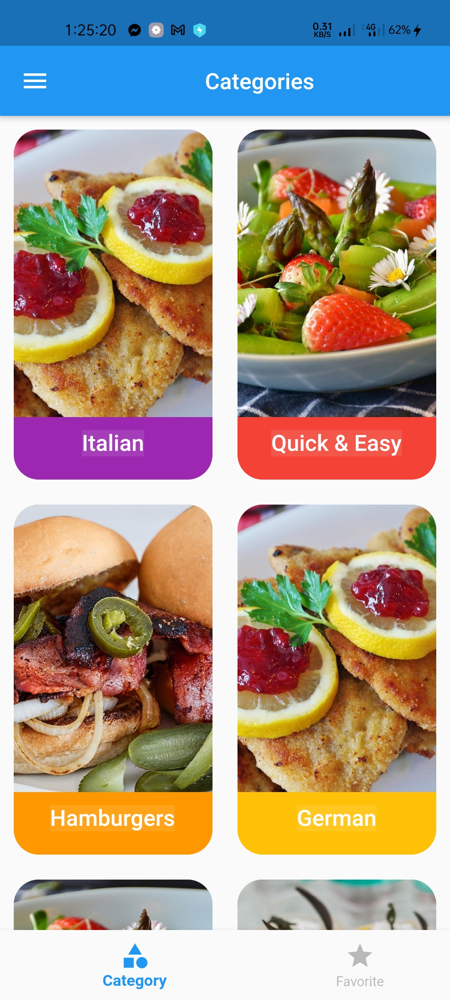
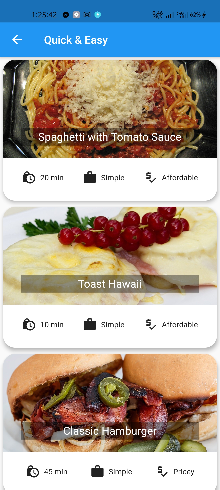
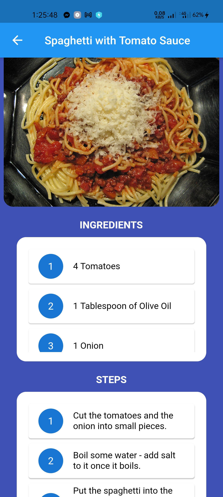
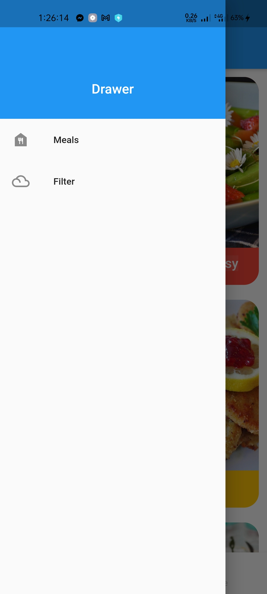
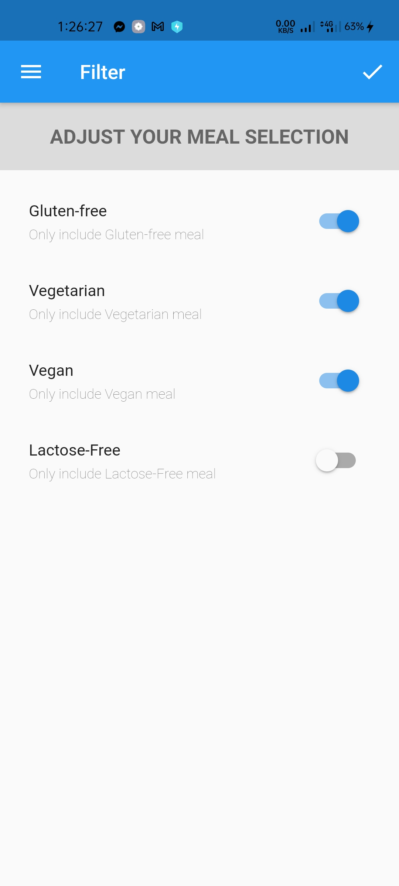
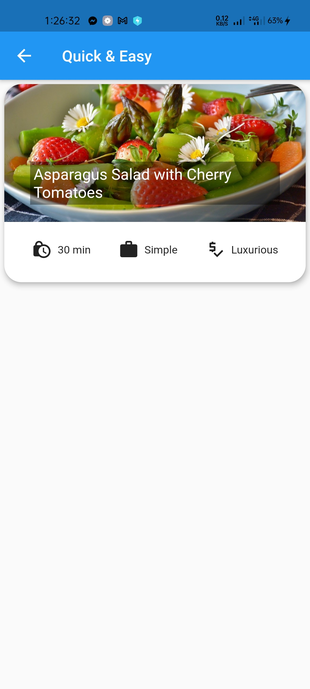

# FoodApp
A simple food application UI design
<!DOCTYPE html>
<html>
<body>

 1. Category Screen

 2. Explore a Category, like Queck & Easy

 3. Item Details

 4. Drower

 5. Filter Meal

 6. Items After filter

</body>
</html>
